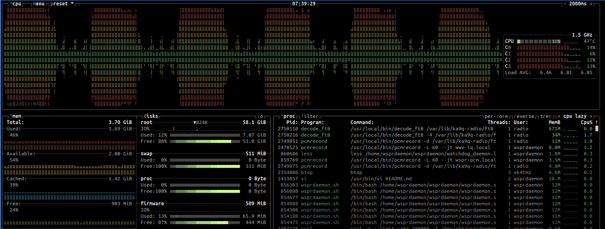

# Notes on setting up WSPRDaemon used with KA9Q-Radio                                                                                                                                                            
                                                                                                                                                                                                              
## Overview                                                                                                                                                                                                   
                                                                                                                                                                                                              
These are my notes and thought on how I setup WSPRDaemon with 'KA9Q-Radio'.

The first thing that I'd like to point out was while there appeared to be lots of documentation it did seem stale / incomplete. 
The obvious example of this was the lack of clearly explaining how to configure WSPRDaemon to work KA9Q-Radio and especially  with an 'external' (ie independent) instance of KA9Q-Radio.  

To configure WSPRDaemon to work with KA9Q-Radio and spin up 'pcmrecord' recording processes we need to have the following config items:

* Ensure your defined receivers start with the prefix "**KA9Q_**".
* We need to add the **KA9Q_RUNS_ONLY_REMOTELY** option to disable WSPRDaemon from downloading and setting up and instance of both "**KA9Q-Radio**" and "**KA9Q-Radio-Web**". However, with this option it should be noted that the "pcmrecord" recording process will not be started and or stopped by the "wda/wdz" commands.
```
KA9Q_RUNS_ONLY_REMOTELY="yes"
```
* To enable WSPRDaemon to at minimum start the "pcmrecord" processes we need to specify the following PCMRECORD options:
```
KA9Q_RADIO_PCMRECORD_CMD="/usr/local/bin/pcmrecord"
PCMRECORD_ENABLED="yes"
```

For more information you can review the FULL version of the WSPRDaemon config file:  "[wd_template_full.conf](https://github.com/rrobinett/wsprdaemon/blob/master/wd_template_full.conf)".  But its full 100% complete as you see from the PCMRECORD options.

## WSPRDameon External KA9Q-Radio Patch

I had to slightly modify the following files to enable me to start WSPRDaemon and have it work as expected with external instance of KA9Q-Radio:

* [ka9q-utils.sh](https://github.com/rrobinett/wsprdaemon/blob/master/ka9q-utils.sh)
* [recording.sh](https://github.com/rrobinett/wsprdaemon/blob/master/recording.sh)

To apply the patch [wsprdaemon_ka9q-radio-external.patch](https://github.com/vk4tmz/ka9q-radio-misc/blob/main/wsprdaemon/wsprdaemon_ka9q-radio-external.patch):

```
cd ~/wsprdaemon
git apply ~/tools/ka9q-radio-misc/wsprdaemon/wsprdaemon_ka9q-radio-external.patch
```

## Config Examples

I have 2 examples of WSPRDaemon config:

* [wsprdaemon_raspi4.conf](https://github.com/vk4tmz/ka9q-radio-misc/blob/main/wsprdaemon/conf/wsprdaemon_raspi4.conf) 
    Used under contraint resource host such as the  RaspberryPI 4.  

    It only has the WSPR W2 mode decoding enabled, and excludes the WWV-IQ and the WSPR (F2 and F5) modes. 

    On the RasPI4 you can see at the end of the 2min cycle the CPU goes to 100% for the first minute and on the dot comes back down to ~10-15% CPU for last minute of cycle (this is mostly recording and you do see the FT8/FT4 decoders blipping every 15sec). This seems to work fine and successfully get good levels of decodes for WSPR, FT8 and FT4. **NOTE: There is a config item 'WSPRD_CMD_FLAGS' that allows you to reduce the DEPTH from the default 4 levels to some something lower.**

    

* [wsprdaemon_full.conf](https://github.com/vk4tmz/ka9q-radio-misc/blob/main/wsprdaemon/conf/wsprdaemon_full.conf) - Full version used when testing on more powerful host.


